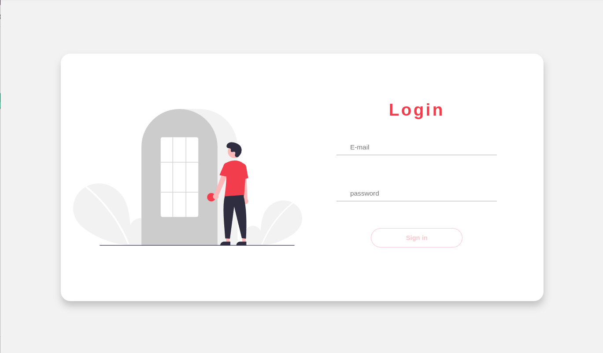
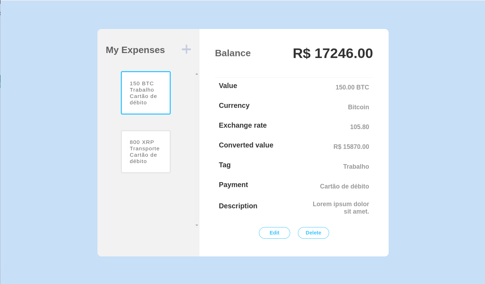
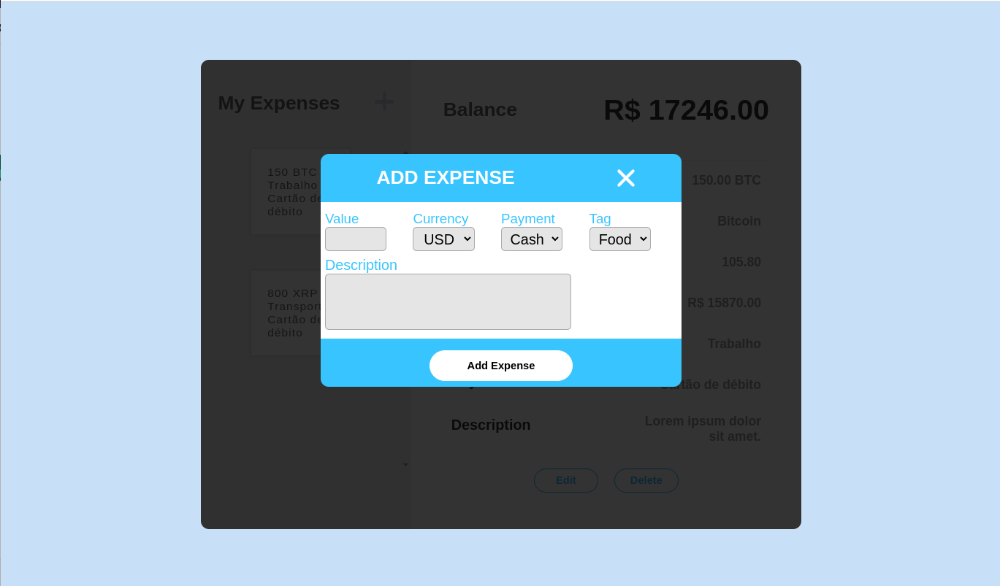

# Expenses Manager project

This project was developed during the [Trybe's](https://www.betrybe.com/) Front-end module

## Overview

This project was built with React Redux

Users should be able to:

- Add, remove and edit an expense;
- View a table with your expenses;
- View the total expenses converted to a currency of choice;

### Demo
- [Live project](https://vinicius-expenses-manager.vercel.app/)

### Screenshots

